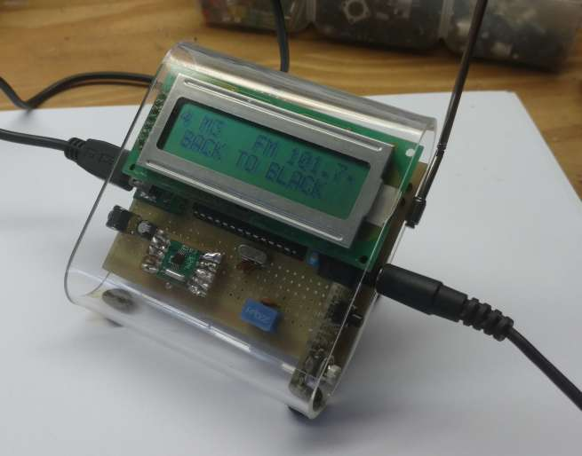

# PIC18RADIO

RDA5807 FM RADIO with Microchip PIC18F2520

Is a very simple firmware to control RDA5807 I2C radio ic. 

- 2x16 LCD display.
- stores 6 memory positions.
- RDS ready.
- Volume control.

2/15/2016 11:46:35 AM 